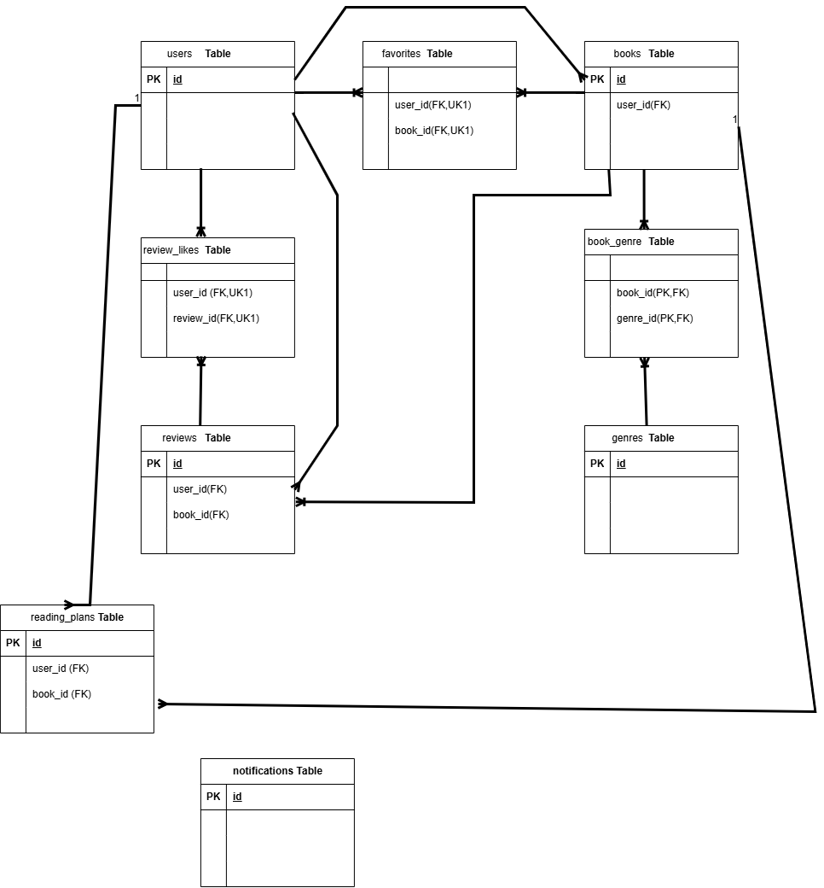

# BookShelf

## 概要

Laravelを使用して作成した書籍管理アプリケーションです。

書籍の登録・編集・削除、検索・並び替え・ページネーション、お気に入り、レビュー、ジャンル管理、ランキング、読書計画、読書レポートなどの機能を実装しています。

また、Google Books APIを利用したISBN検索、Laravel SanctumによるAPI認証、認可機能、読書計画に関する通知・バッチ処理・スケジュール実行も実装しています。

## 主な機能

- ユーザー登録・ログイン
- 書籍一覧・詳細表示
- 書籍の登録・編集・削除
- 書籍検索
- 書籍の並び替え
- ページネーション
- Google Books APIを利用したISBN検索
- お気に入り登録・解除
- レビュー投稿・編集・削除
- ジャンル管理
- 書籍ランキング
- 読書計画の作成・編集・削除・完了
- 読書計画の期限超過管理
- 読書計画のリマインダー通知
- マイ読書レポート
- Laravel SanctumによるAPI認証
- APIでの書籍CRUD
- Policyによる認可
- PHPUnitによるテスト

## ER図

## 環境構築

### 1. リポジトリをクローン

`git clone git@github.com:kao1982/bookshelf-app.git`

`cd bookshelf-app`

### 2. `.env`を設定

`.env.example`をコピーして`.env`を作成します。

`cp .env.example .env`

必要に応じてデータベースやGoogle Books APIなどの設定を行います。

### 3. Composerパッケージをインストール

`composer install`

### 4. Laravel Sailを起動

`./vendor/bin/sail up -d`

### 5. アプリケーションキーを生成

`./vendor/bin/sail artisan key:generate`

### 6. データベースを作成・初期化

`./vendor/bin/sail artisan migrate:fresh --seed`

### 7. npmパッケージをインストール

`npm install`

### 8. Viteを起動

`npm run dev`

## 初期ログイン情報

| 項目           | 内容                                            |
| -------------- | ----------------------------------------------- |
| メールアドレス | [yamada@example.com](mailto:yamada@example.com) |
| パスワード     | password                                        |

## 使用技術

- PHP 8.5.7
- Laravel 10.50.2
- Laravel Sail
- MySQL 8.4
- Laravel Sanctum
- Blade
- Tailwind CSS
- Alpine.js
- Vite
- Google Books API
- Mailpit
- PHPUnit

## API

### 認証

ログインAPIで取得したトークンを、Bearer Tokenとして使用します。

| メソッド | エンドポイント         | 内容         | 認証 |
| -------- | ---------------------- | ------------ | ---- |
| POST     | `/api/v1/login`        | ログイン     | 不要 |
| GET      | `/api/v1/books`        | 書籍一覧取得 | 必要 |
| GET      | `/api/v1/books/{book}` | 書籍詳細取得 | 必要 |
| POST     | `/api/v1/books`        | 書籍登録     | 必要 |
| PUT      | `/api/v1/books/{book}` | 書籍更新     | 必要 |
| DELETE   | `/api/v1/books/{book}` | 書籍削除     | 必要 |

## バッチ・スケジュール

読書計画の期限超過処理を実行します。

`./vendor/bin/sail artisan app:update-overdue-reading-plans`

読書計画のリマインダー通知を送信します。

`./vendor/bin/sail artisan app:send-reading-plan-reminders`

Laravelのスケジューラーを起動します。

`./vendor/bin/sail artisan schedule:work`

## 開発環境のURL

- アプリケーション：http://localhost
- Vite：http://localhost:5173
- phpMyAdmin：http://localhost:8080
- Mailpit：http://localhost:8025

## 作成者

松澤薫
